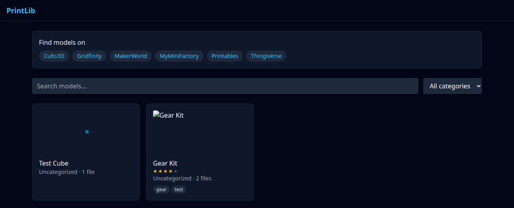

# PrintLib

A self-hosted library for your 3D printer model files: upload single files or
zip bundles (auto-grouped into one model), browse and search, tag and
categorize, preview STLs in the browser, rate your favorites, and keep a print
history with photos and notes. Browsing is public by default; editing requires
a login.



## Features

- Upload a single file or a `.zip` — zips are extracted and grouped as one
  model with multiple files
- Search and filter by category and tag
- In-browser 3D preview for STL files (drag to orbit)
- Pick any angle as the model's thumbnail, or reuse a print-log photo
- Optional source URL per model, so you can credit the original designer
  instead of just hosting a pile of anonymous files
- 1–5 star ratings
- Print history per model: success/fail, date, printer, material, notes, and
  a photo
- A home-page panel linking out to popular model sites (Printables,
  MakerWorld, Thingiverse, MyMiniFactory, Cults3D, Gridfinity by default),
  editable once logged in
- Installable as a PWA
- Single shared login (no user accounts) gates uploads/edits/deletes; viewing
  the library, searching, and downloading stays open to anyone who can reach
  the site — the login just isn't linked from anywhere, you go to `/login`
  directly

## Stack

React + TypeScript + Vite (PWA) frontend, Node.js + Fastify backend, SQLite
for metadata, local disk for the actual files. See [PLAN.md](./PLAN.md) for
the fuller design write-up and roadmap.

## Running it

### Quickstart with Docker

```bash
git clone https://github.com/<your-fork>/printlib.git
cd printlib
cp apps/api/.env.example apps/api/.env
# edit apps/api/.env: set ADMIN_PASSWORD and SESSION_SECRET (openssl rand -hex 32)
docker compose up -d --build
```

The app is now on `http://localhost:8000`, serving both the API and the built
frontend from one container. Uploaded files and the SQLite database live in
`./data` (bind-mounted), so they survive rebuilds.

### Local development (without Docker)

Requires Node 22+.

```bash
npm install
npm run build -w @printlib/shared   # the api imports this at runtime

# terminal 1 — API
cd apps/api
cp .env.example .env   # set ADMIN_PASSWORD and SESSION_SECRET
DATA_DIR=./data npm run dev

# terminal 2 — frontend (proxies /api to the API above)
npm run dev -w @printlib/web
```

The frontend dev server prints its own URL (default `http://localhost:5173`).

### Environment variables

Set in `apps/api/.env` (see `apps/api/.env.example`):

| Variable          | Required | Description                                    |
| ----------------- | -------- | ----------------------------------------------- |
| `ADMIN_PASSWORD`  | yes      | The one shared password for logging in          |
| `SESSION_SECRET`  | yes      | Random secret signing the session cookie        |
| `DATA_DIR`        | no       | Where the DB and uploaded files live (`./data`) |
| `PORT`            | no       | API port (`8000`)                               |

### Deploying behind your own reverse proxy

For anything beyond local use, put this behind a reverse proxy (nginx, Caddy,
Traefik, whatever you already run) with TLS, and point it at the container's
port 8000. `docker-compose.yml` at the repo root is the standalone/local
version — in a real deployment you'd typically build this same `Dockerfile`
as a service inside your existing proxy's compose stack instead of publishing
the port directly. Session cookies are marked `secure` in production
(`NODE_ENV=production`, set automatically in the Docker image), so the app
needs to be served over HTTPS for login to work once it's reachable outside
your LAN.

## Contributing

Issues and PRs welcome. There's no test suite yet — if you're adding
something non-trivial, a quick note in the PR about how you verified it
(commands run, screenshots) is appreciated.

## License

[MIT](./LICENSE)

---

If PrintLib is useful to you, consider [buying me a coffee](https://www.buymeacoffee.com/YOUR_USERNAME_HERE) ☕
