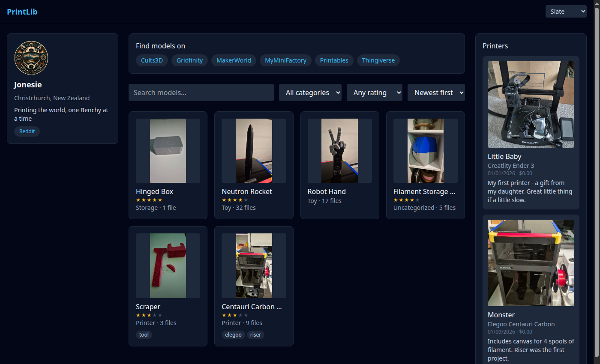

# PrintLib

[](https://github.com/Jonesie/printlib/actions/workflows/ci.yml)

A self-hosted library for your 3D printer model files: upload single files or
zip bundles (auto-grouped into one model), browse and search, tag and
categorize, preview STLs in the browser, rate your favorites, and keep a print
history with photos and notes. Browsing is public by default; editing requires
a login.



## Features

- Upload a single file or a `.zip` — zips are extracted and grouped as one
  model with multiple files
- Search, filter by category and minimum star rating, sort by name or date
  (sort order remembered per browser)
- In-browser 3D preview for STL files (drag to orbit)
- Pick any angle as the model's thumbnail, or reuse a print-log photo
- Optional source URL per model, so you can credit the original designer
  instead of just hosting a pile of anonymous files
- 1–5 star ratings
- Print history per model: success/fail, date, printer, material, notes, and
  a photo — click any photo or preview image for a full-size lightbox
- A home-page panel linking out to popular model sites (Printables,
  MakerWorld, Thingiverse, MyMiniFactory, Cults3D, Gridfinity by default),
  editable once logged in
- Share a print log (with its photo) to Bluesky, Facebook or Instagram from the
  print history; each button is disabled until that site is configured (see the
  environment variables below)
- A printers section for your own hardware: name, model, purchase date and
  price, a photo, and notes
- A profile panel (name, avatar, location, bio, email/phone, social links) —
  only a name is required
- Four color themes, remembered per browser
- Installable as a PWA
- Checks GitHub for a newer release on startup and once a day; if one exists,
  a link appears next to the version number in the footer (skipped entirely
  for from-source builds, which have no release version to compare against)
- Single shared login (no user accounts) gates uploads/edits/deletes; viewing
  the library, searching, and downloading stays open to anyone who can reach
  the site — the login just isn't linked from anywhere, you go to `/login`
  directly

## Stack

React + TypeScript + Vite (PWA) frontend, Node.js + Fastify backend, SQLite
for metadata, local disk for the actual files. See [PLAN.md](./PLAN.md) for
the fuller design write-up and roadmap.

## Running it

There are two ways to get a copy running: pull a released image (fastest, no
build step), or build from source (if you want the latest unreleased changes,
or to modify the app).

### Option A — a released version

Every [release](https://github.com/Jonesie/printlib/releases) publishes a
container image to GitHub Container Registry. No clone, no build:

```bash
mkdir printlib && cd printlib
cat > docker-compose.yml <<'EOF'
services:
  printlib:
    image: ghcr.io/jonesie/printlib:latest   # or a specific version, e.g. :1.2.0
    environment:
      ADMIN_PASSWORD: change-me
      SESSION_SECRET: change-me   # e.g. `openssl rand -hex 32`
    volumes:
      - ./data:/data
    ports:
      - "8000:8000"
EOF
docker compose up -d
```

### Option B — build from source

```bash
git clone https://github.com/Jonesie/printlib.git
cd printlib
cp apps/api/.env.example apps/api/.env
# edit apps/api/.env: set ADMIN_PASSWORD and SESSION_SECRET (openssl rand -hex 32)
docker compose up -d --build
```

`docker-compose.yml` loads `apps/api/.env` into the container, so the file must
exist before you start it. Without `ADMIN_PASSWORD` and `SESSION_SECRET` the app
exits immediately on startup (check with `docker compose logs printlib`).

Either way, the app is now on `http://localhost:8000`, serving both the API
and the built frontend from one container. Uploaded files and the SQLite
database live in `./data` (bind-mounted), so they survive rebuilds/updates.

### Local development (without Docker)

Requires Node 22+.

```bash
npm install
npm run build -w @printlib/shared   # the api imports this at runtime

# terminal 1 — API
cd apps/api
cp .env.example .env   # set ADMIN_PASSWORD and SESSION_SECRET
DATA_DIR=./data npm run dev

# terminal 2 — frontend (proxies /api to the API above)
npm run dev -w @printlib/web
```

The frontend dev server prints its own URL (default `http://localhost:5173`).

### Environment variables

Set in `apps/api/.env` (see `apps/api/.env.example`):

| Variable          | Required | Description                                    |
| ----------------- | -------- | ----------------------------------------------- |
| `ADMIN_PASSWORD`  | yes      | The one shared password for logging in          |
| `SESSION_SECRET`  | yes      | Random secret signing the session cookie        |
| `DATA_DIR`        | no       | Where the DB and uploaded files live (`./data`) |
| `PORT`            | no       | API port (`8000`)                               |
| `BLUESKY_HANDLE`  | no       | Bluesky handle for sharing print logs (e.g. `you.bsky.social`) |
| `BLUESKY_APP_PASSWORD` | no  | A Bluesky *app password* (not your login password); sharing is off unless both are set |
| `FACEBOOK_PAGE_ID`, `FACEBOOK_PAGE_ACCESS_TOKEN` | no | Facebook Page ID and a Page access token, to share print logs to the Page; off unless both are set |
| `INSTAGRAM_ACCOUNT_ID`, `INSTAGRAM_ACCESS_TOKEN` | no | Instagram Business/Creator account ID and access token; also needs an internet-reachable `PUBLIC_URL` (Instagram fetches the photo) and a print log with a photo |
| `PUBLIC_URL`      | no       | Public URL of the site; shared posts link back to the model page |
| `SHOW_GET_PRINTLIB_PANEL` | no | Set to `false` to hide the "Want your own PrintLib?" panel on the home page (shown by default) |

### Sharing to social sites

Each print log in the print history has a **Share** row with a button per site.
A button is greyed out until that site is configured. Set the variables in
`apps/api/.env`, then recreate the container (`docker compose up -d --force-recreate`)
so they're picked up. All three are optional, and any combination works.

Set `PUBLIC_URL` (e.g. `https://printlib.example.com`) if you want shared posts
to link back to the model page.

#### Bluesky

1. In Bluesky go to **Settings → Privacy and security → App passwords** and
   create one. Use this, never your login password.
2. Set `BLUESKY_HANDLE` (e.g. `you.bsky.social`) and `BLUESKY_APP_PASSWORD`.

Photos over Bluesky's size limit are shrunk automatically before posting.

#### Facebook (Page)

Posts go to a Facebook **Page** you manage, not to a personal profile (Facebook's
API doesn't allow that).

1. Create an app at [developers.facebook.com](https://developers.facebook.com/apps)
   (type: Business) and add yourself as a developer or tester.
2. In the [Graph API Explorer](https://developers.facebook.com/tools/explorer/),
   pick your app, choose **Get Page Access Token**, and grant `pages_show_list`,
   `pages_read_engagement` and `pages_manage_posts`. Select your Page.
3. That token is short-lived. Exchange it for a long-lived one (see Meta's
   [access token docs](https://developers.facebook.com/docs/facebook-login/guides/access-tokens/get-long-lived)),
   then request the Page's token from `/me/accounts` using the long-lived user
   token — a Page token obtained that way doesn't expire.
4. Set `FACEBOOK_PAGE_ID` (the Page's numeric ID, shown on its About page or in
   the `/me/accounts` response) and `FACEBOOK_PAGE_ACCESS_TOKEN`.

#### Instagram

Posting needs an Instagram **Business or Creator** account linked to a Facebook
Page, and a print log **with a photo** (Instagram doesn't allow text-only posts).

1. Switch the Instagram account to Business or Creator in the Instagram app and
   link it to your Facebook Page.
2. Using the same Meta app as above, generate a token with
   `instagram_basic`, `instagram_content_publish` and `pages_show_list`, and
   make it long-lived as in the Facebook steps.
3. Find the Instagram account ID: call `/{page-id}?fields=instagram_business_account`
   in the Graph API Explorer; the `id` inside `instagram_business_account` is it.
4. Set `INSTAGRAM_ACCOUNT_ID` and `INSTAGRAM_ACCESS_TOKEN`.
5. **`PUBLIC_URL` must be reachable from the internet.** Instagram downloads the
   photo from `PUBLIC_URL/api/print-log-photos/...` itself, so a `localhost` or
   LAN-only address won't work. Instagram sharing stays disabled until
   `PUBLIC_URL` is set.

Meta's developer console and permission names change from time to time; if a
step doesn't match what you see, Meta's docs for the
[Pages API](https://developers.facebook.com/docs/pages-api/) and
[Instagram content publishing](https://developers.facebook.com/docs/instagram-platform/content-publishing)
are the source of truth. While your app is in development mode, only you (and
other app roles) can post with it, which is fine for personal use.

### Deploying behind your own reverse proxy

For anything beyond local use, put this behind a reverse proxy (nginx, Caddy,
Traefik, whatever you already run) with TLS, and point it at the container's
port 8000. `docker-compose.yml` at the repo root is the standalone/local
version — in a real deployment you'd typically build this same `Dockerfile`
as a service inside your existing proxy's compose stack instead of publishing
the port directly. Session cookies are marked `secure` in production
(`NODE_ENV=production`, set automatically in the Docker image), so the app
needs to be served over HTTPS for login to work once it's reachable outside
your LAN.

See [`hosting/`](./hosting) for a sample nginx vhost, including an optional
block that restricts the login endpoint to your own LAN/VPN subnet — handy
if you're exposing PrintLib to the public internet and want browsing to stay
open to anyone while login attempts from outside your network get rejected
before they ever reach the app.

## Testing

```bash
npm run test             # shared + api + web
npm run test:coverage    # same, with coverage reports (text + HTML + lcov,
                          # written to coverage/ in each workspace)
```

Every PR and push to `main` runs the full suite via [CI](.github/workflows/ci.yml),
with a coverage summary attached to the workflow run and full HTML reports
uploaded as a build artifact. Coverage is a starting point, not exhaustive —
the API's write-gating and auth logic and a couple of trickier frontend
components are covered; most UI components aren't yet.

## Releasing

Pushing a tag matching `v*` (e.g. `v1.2.0`) runs the
[release workflow](.github/workflows/release.yml): it builds and tests the
project, then publishes a container image to
`ghcr.io/jonesie/printlib:<version>` (and `:latest`) and creates a GitHub
Release with auto-generated notes. The version from the tag is baked into
the frontend build and shown in the page footer.

## Contributing

Issues and PRs welcome — CI needs to be green (build + tests). If you're
adding something non-trivial, a test alongside it and a quick note in the PR
about how you verified it (commands run, screenshots) is appreciated.

## License

[MIT](./LICENSE)

---

If PrintLib is useful to you, consider [buying me a coffee](https://www.buymeacoffee.com/jonesie) ☕
